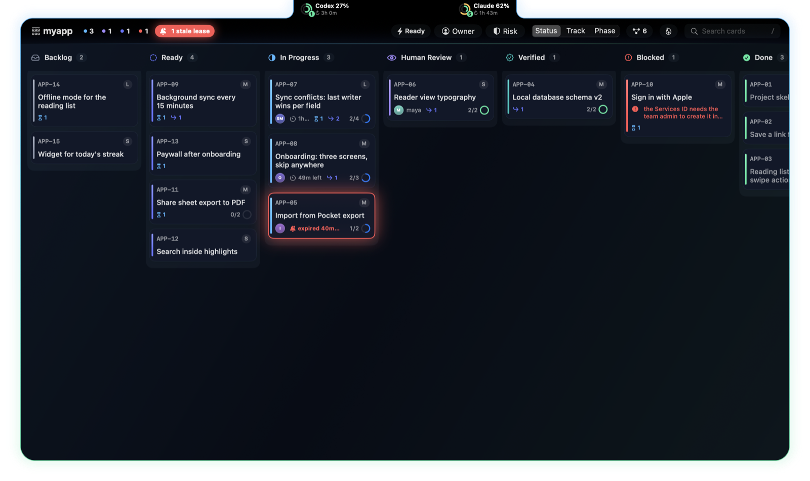
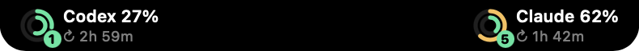
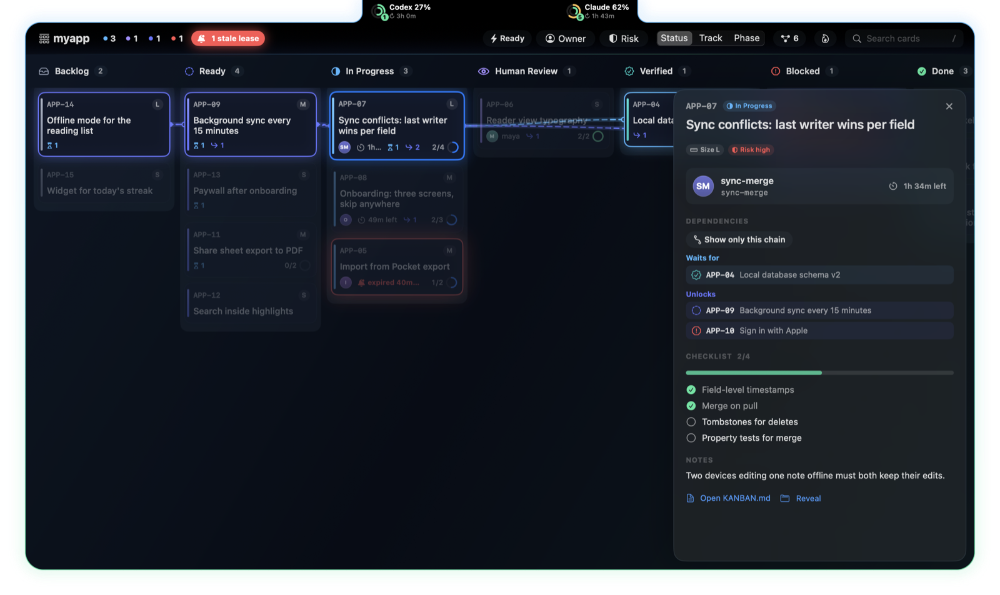
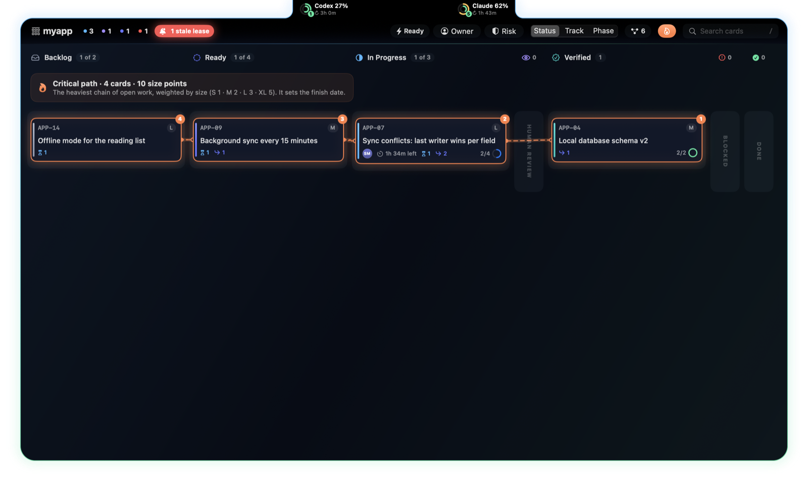
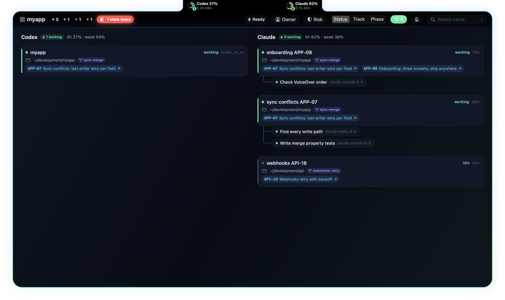

# notchban

A kanban board that lives in your Mac's notch, for people who run coding agents.
It shows every `KANBAN.md` in your projects folder and who is working on what: Claude Code and Codex
sessions, their subagents, their 5-hour and weekly limits. Read-only; it never writes a board.

**[Download the latest release](https://github.com/opsida-technology/notchban/releases/latest)**: unzip, move
`Notchban.app` to Applications, open it. macOS 13 or later, Apple silicon.



## The notch



A pill over the notch with an ear on each side: Codex on the left, Claude on the right. Each ear shows the
5-hour and weekly limits as two rings, the 5-hour figure with when it resets, and how many agents work now.
Put the pointer on the pill (or click it, or ⌥⌘B) and the whole board hangs from the notch; Esc, a click
elsewhere or the pointer leaving closes it. Figures more than half an hour old are dimmed.

## The board

- Seven columns of cards: id, title, owner avatar, size and risk chips, checklist ring, track
  colour, lease countdown, a pulsing red alarm on a stale lease, the blocker line, "waits for N"
  and "unlocks N". Empty columns collapse on their own; click a header to collapse any.
- Lanes by Status, Track or Phase.
- Select a card: what it waits for lights sky blue, what it unlocks indigo, with curves between them;
  "Show only this chain" hides the rest. "Critical path" shows the heaviest open chain, by size.
- Filters: search, owner, track, risk, and "Ready & unblocked" (Ready, no open predecessor, gate open).
- The side sheet: facts, owner and lease, blocker, Proof, dependencies, checklist and notes.
- The agents screen (A, or the toolbar's agents toggle): who works where. Every live Claude Code and Codex session
  is a node with its folder, branch and the cards it names; Claude's subagents branch off below it, with their
  model. The ears' badge counts the same working agents and subagents.
- Reloads the moment a `KANBAN.md` changes (FSEvents); a full rescan each minute finds new boards.
- Always dark, VoiceOver labels; animations respect Reduce Motion.







The screenshots show made-up boards and sessions.

| Key | Does |
|---|---|
| j k h l, arrows | move between cards |
| Return, Space | open or close the card's sheet |
| / | search |
| ⌘K | palette: any card on any board, boards, view commands |
| g | cycle lanes: Status, Track, Phase |
| a | the agents screen |
| c | critical path |
| f | only the selected card's chain |
| r | only ready and unblocked |
| [ ] | previous / next board |
| Esc | back out one layer |
| ⌘Q | quit (also in the board switcher's menu) |

## A board

A board is a `KANBAN.md` at a repository's root whose first line is `# Kanban`. The `##` section a card sits in
is its status:

```markdown
# Kanban
<!-- squawk-kanban:v1 -->

## Backlog

## Ready

### KB-12 — Short imperative title
<!-- squawk:{"owner":"agent:task-x","after":["KB-09"],"size":"M"} -->

- [ ] Acceptance item one
- [ ] Acceptance item two

## In Progress

## Human Review

## Verified

## Blocked

## Done
```

The metadata line is optional JSON: `owner`, `task`, `lease`, `after`/`before` (predecessor and successor ids),
`track`, `phase`, `size`, `risk`, `tier` and `gate`. `Proof:` and `Blocker:` lines are shown on their own.
The full format, written as a Claude Code skill, is in [docs/kanban-skill.md](docs/kanban-skill.md); the app
offers to install it the first time the board opens, so your agents keep the board current.

## Where the data comes from

Everything is read on your Mac, and nothing is written except where the app asks first.

- **Boards**: every `KANBAN.md` up to three folders deep under your projects folder, which the app asks for the first
  time the board opens (`~/development` until then). Change it later from the board
  switcher's menu ("Boards Folder…"). A repository's board is read from `origin/main`, fetched every minute, so a
  push from another machine shows at once.
- **Codex**: limits and sessions from `~/.codex/sessions`.
- **Claude Code**: sessions from `~/.claude/sessions` and their `subagents/` folders. Claude Code hands its
  limits only to a status line command, so the app offers to add one that saves them to a file. It asks first,
  keeps a backup of `settings.json` and never replaces an existing status line.
- **Claude limits from Anthropic** (off by default; the board switcher's menu): reads Claude Code's sign-in from
  the Keychain, which macOS asks you to allow, and asks Anthropic's usage endpoint for the two limits every three
  minutes. That endpoint is not a documented API and may stop working.

## Build

```bash
swift test
swift run notchban          # or: swift run notchban myapp, to open that board
scripts/package.sh          # Notchban.app in ./build; set NOTARY_PROFILE to sign and notarize
```

## License

MIT. See [LICENSE](LICENSE).
